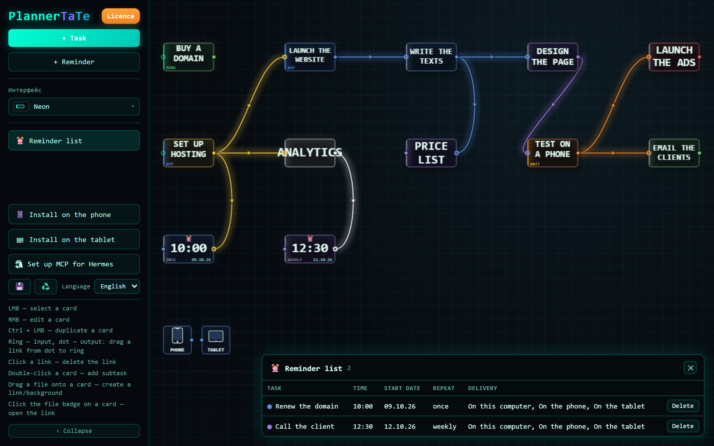
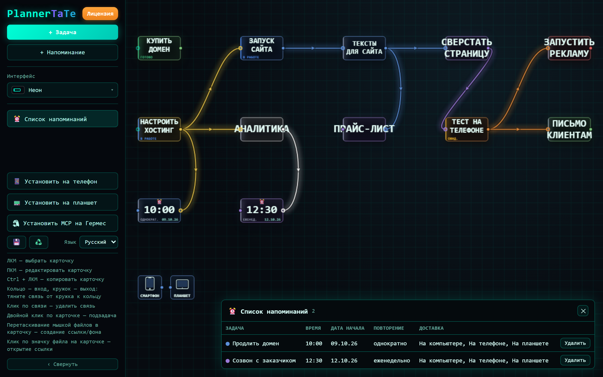

# PlannerTaTe

**A task planner where your plan is a map, not a list.** Tasks live as cards on an endless canvas, and you link them into a graph — so you can see what a project is made of, what depends on what, and what is in progress right now.

Windows desktop application + Android companion, connected over your own home network. Everything is stored locally: no cloud, no account, no telemetry.



## What it does

**Shows the whole plan at once.** Not a hundred-row list, but a map: break a big task into subtasks, collapse what is not needed right now, bring the important things to the front.

**Does not let you forget.** A card can carry a due date and a reminder: at the chosen time the computer shows a Windows notification, and your phone (or tablet) rings like a real alarm — even when the app is closed or the device has been restarted.

**Keeps the devices in step.** The phone app holds a copy of the plan (you can read it without the computer) and can add new tasks; on sync everything is merged back into the computer.

## How it works

| Part | Role |
|---|---|
| **Computer** — Windows 10/11 | The workplace: create and edit cards, link them, set dates and reminders. Lives in the system tray and saves everything automatically to `graph.json` |
| **Phone / tablet** — Android 8+ | Keeps a copy of the plan and rings the alarms. Talks to the computer over your home Wi-Fi or a USB cable, port **5001** |

Access from the network is protected by an access key: from the computer itself everything is allowed, from the network the key is required. Actions with files and payment are allowed only from the computer.

## Installation

### On the computer
1. Download **`PlannerTaTe_Setup_1.1.exe`** from the [Releases page](https://github.com/yaroslav-softcode/PlannerTaTe/releases) and run it. Administrator rights are not required.
2. When Windows asks about network access, allow it **for private networks** — otherwise the phone will not be able to connect.
3. The planner opens in the browser and stays in the tray (a small icon next to the clock): from there you can open the planner, look up the address and the key for the phone, or exit.

### On the phone or tablet
1. Install **`PlannerTaTe.apk`** (Android 8 or newer). The easy way is the “Install on a device” page inside the planner on the computer; the same file is in this repository at `app/PlannerTaTe.apk`.
2. Open the app on the phone: it finds the computer on the network by itself, or you can type the address shown on the computer.
3. Enter the access key. The key is created on the first launch — 10 characters without look-alike symbols (0/O, 1/I/L), easy to dictate.

A one-page quick guide (in Russian) is in [`ПАМЯТКА.pdf`](ПАМЯТКА.pdf).

## Where the data lives

Everything is kept in `%APPDATA%\PlannerTaTe` on your computer: the plan (`graph.json`), the access key and the reminder state. Nothing is sent anywhere — the network is used only so that your own phone can reach your own computer.

## What is in this repository

| Path | What it is |
|---|---|
| `backend.py` | the local server (Flask): serves the interface, the API and the graph |
| `plannertate.py` | the desktop launcher: tray icon, single instance, shortcuts, log |
| `Запустить PlannerTaTe.bat` | run straight from the sources without building |
| `frontend/` | the interface: Vue 3 + Vite + LiteGraph (cards drawn on a `<canvas>`) |
| `app/PlannerTaTe.apk` | ready Android build of the companion app |
| `ПАМЯТКА.*`, `ОПИСАНИЕ_ФУНКЦИЙ.*` | documentation for the user (Russian) |
| `ОПИСАНИЕ_картинки/` | screenshots used in the documentation |
| `PlannerTaTe.spec`, `PlannerTaTe.iss`, `PlannerTaTe_version.txt`, `PlannerTaTe.ico` | the Windows build (PyInstaller + Inno Setup) |
| `mcp/` | optional: 17 tools that let an AI agent read and fill the plan |
| `make_icon.py` | draws `PlannerTaTe.ico` |

## Building and running from the sources

Required: Windows, **Python 3.12** with `flask` and `PyQt5`, **Node.js 20+** for the interface; PyInstaller and Inno Setup 6 only for the full installer.

```bash
# 1) the interface
cd frontend
npm install
npm run build              # -> frontend/dist

# 2) run the planner from the sources
cd ..
python backend.py          # opens http://127.0.0.1:5001
python plannertate.py      # the same, but with the tray icon

# 3) the Windows installer (optional)
pyinstaller --clean --noconfirm PlannerTaTe.spec
ISCC.exe PlannerTaTe.iss   # -> dist\PlannerTaTe_Setup_1.1.exe
```

Environment variables for tests and special cases: `PLANNERTATE_PORT`, `PLANNERTATE_HOST`, `PLANNERTATE_DATA` (a different data folder), `PLANNERTATE_NO_BROWSER`, `PLANNERTATE_NO_SHORTCUT`.

## Technology

Python 3.12 + Flask · Vue 3 + Vite + LiteGraph.js (canvas) · PyInstaller + Inno Setup for the Windows build · Kotlin + WebView for the Android companion. The interface is available in **Russian and English**.

## License

MIT — see [LICENSE](LICENSE). © Yaroslav Khmelev.

---

# PlannerTaTe (по-русски)

**Планировщик задач, в котором план — это карта, а не список.** Задачи живут карточками на бесконечном холсте, а вы соединяете их связями: видно, из чего состоит дело, что от чего зависит и что в работе прямо сейчас.

Приложение для Windows и приложение-спутник для Android, связанные через вашу домашнюю сеть. Всё хранится локально: без облака, без учётной записи, без телеметрии.



## Что программа делает

**Показывает план целиком.** Не список из ста строк, а карта: большое дело раскладывается на подзадачи, лишнее сворачивается в сторону, важное выносится вперёд.

**Не даёт забыть.** У карточки ставится срок и напоминание: в назначенный час компьютер показывает уведомление Windows, а телефон (или планшет) звонит настоящим будильником — даже если приложение закрыто или устройство перезагружалось.

**Держит устройства в курсе.** Приложение на телефоне хранит копию плана (можно смотреть без компьютера) и умеет добавлять новые задачи; при синхронизации всё сходится с компьютером.

## Как это работает

| Часть | Роль |
|---|---|
| **Компьютер** — Windows 10/11 | Рабочее место: создание и правка карточек, связи, сроки и напоминания. Живёт в трее рядом с часами, всё сохраняет само в `graph.json` |
| **Телефон / планшет** — Android 8+ | Хранит копию плана и звонит будильниками. Связь с компьютером — по домашнему Wi-Fi или кабелю, порт **5001** |

Доступ из сети защищён ключом: со своего компьютера — свободно, из сети — нужен ключ. Действия с файлами и оплатой разрешены только с компьютера.

## Установка

### На компьютер
1. Скачайте **`PlannerTaTe_Setup_1.1.exe`** со [страницы выпусков](https://github.com/yaroslav-softcode/PlannerTaTe/releases) и запустите. Права администратора не нужны.
2. Когда Windows спросит про доступ к сети — выберите **«Разрешить» для частных сетей**, иначе телефон не подключится.
3. Планировщик откроется в браузере и останется в трее (маленький значок рядом с часами): через него можно открыть планировщик, посмотреть адрес и ключ для телефона, выйти.

### На телефон или планшет
1. Установите **`PlannerTaTe.apk`** (Android 8 и новее). Проще всего — через страницу «Установка на устройство» в планировщике на компьютере; тот же файл лежит в репозитории: `app/PlannerTaTe.apk`.
2. Откройте приложение на телефоне: оно само найдёт компьютер в сети, либо впишите адрес, показанный на компьютере.
3. Введите ключ доступа. Ключ создаётся при первом запуске — 10 знаков без похожих символов (0/O, 1/I/L), удобно продиктовать.

Памятка на один лист — [`ПАМЯТКА.pdf`](ПАМЯТКА.pdf).

## Где хранятся данные

Всё лежит в `%APPDATA%\PlannerTaTe` на вашем компьютере: план (`graph.json`), ключ доступа и состояние напоминаний. Наружу ничего не уходит — сеть нужна только чтобы ваш телефон дотянулся до вашего компьютера.

## Что в репозитории

| Путь | Что это |
|---|---|
| `backend.py` | локальный сервер (Flask): отдаёт интерфейс, API и граф |
| `plannertate.py` | запуск на компьютере: значок в трее, единственный экземпляр, ярлыки, журнал |
| `Запустить PlannerTaTe.bat` | запуск прямо из исходников, без сборки |
| `frontend/` | интерфейс: Vue 3 + Vite + LiteGraph (карточки рисуются на `<canvas>`) |
| `app/PlannerTaTe.apk` | готовая сборка приложения для телефона |
| `ПАМЯТКА.*`, `ОПИСАНИЕ_ФУНКЦИЙ.*` | документация для пользователя |
| `ОПИСАНИЕ_картинки/` | снимки экрана для документации |
| `PlannerTaTe.spec`, `PlannerTaTe.iss`, `PlannerTaTe_version.txt`, `PlannerTaTe.ico` | сборка для Windows (PyInstaller + Inno Setup) |
| `mcp/` | дополнительно: 17 инструментов, которыми ИИ-агент читает и заполняет план |
| `make_icon.py` | рисует `PlannerTaTe.ico` |

## Сборка и запуск из исходников

Нужны: Windows, **Python 3.12** с `flask` и `PyQt5`, **Node.js 20+** для интерфейса; PyInstaller и Inno Setup 6 — только для полного установщика.

```bash
# 1) интерфейс
cd frontend
npm install
npm run build              # -> frontend/dist

# 2) запуск из исходников
cd ..
python backend.py          # откроется http://127.0.0.1:5001
python plannertate.py      # то же самое, но со значком в трее

# 3) установщик для Windows (не обязательно)
pyinstaller --clean --noconfirm PlannerTaTe.spec
ISCC.exe PlannerTaTe.iss   # -> dist\PlannerTaTe_Setup_1.1.exe
```

Переменные окружения для проверок и особых случаев: `PLANNERTATE_PORT`, `PLANNERTATE_HOST`, `PLANNERTATE_DATA` (другая папка данных), `PLANNERTATE_NO_BROWSER`, `PLANNERTATE_NO_SHORTCUT`.

## Технологии

Python 3.12 + Flask · Vue 3 + Vite + LiteGraph.js (canvas) · PyInstaller + Inno Setup для сборки под Windows · Kotlin + WebView для приложения на телефоне. Интерфейс — **русский и английский**.

## Лицензия

MIT — см. [LICENSE](LICENSE). © Ярослав Хмелев.
